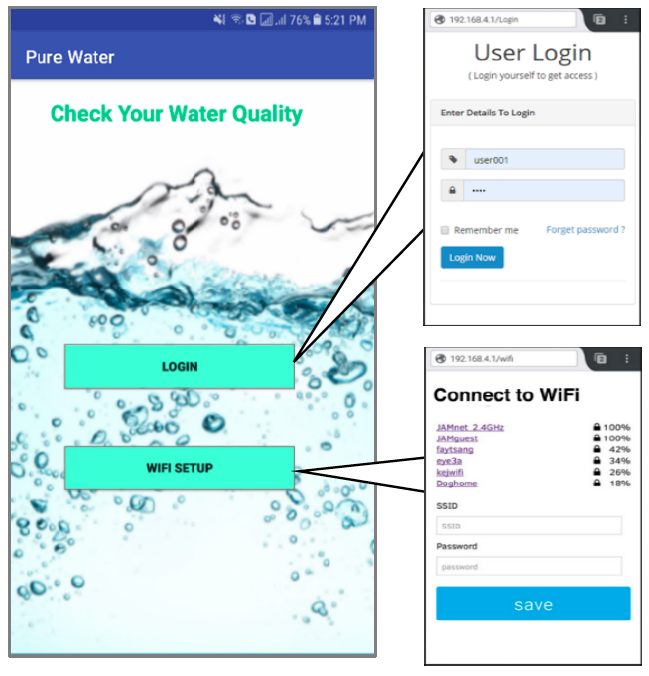

# Real-Time-Water-Quality-Monitoring-and-Contamination-event-Detection-using-Machine-Learning
It was my final year project. 
There were three members(including me) in my group. Here we implemented four sensors to detect water quality of a storage tank. The user can see the real-time reading of the sensors using the Website &amp; through the Android app.  
## Video demo: 
https://drive.google.com/file/d/1HO313AfypfGtwzoxLTGwcj2Tgw4z8QUb/view

## Screenshots:

