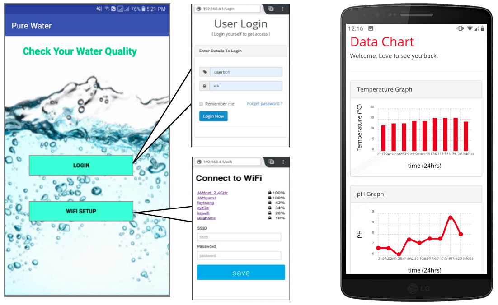

# Real-Time-Water-Quality-Monitoring-and-Contamination-event-Detection-using-Machine-Learning

Here, we propose an Internet of Things (IoT) enabled remote sensing kit for multipara-meter based water quality monitoring and contamination event detection. The proposed kit is able to collect real-time data from household reservoirs, analyze and display them on an easy to use platform for monitoring purpose. It can measure Temperature (T), pH, Electrical Conductivity (EC), and Turbidity (Tb), as vital indicators of water quality. It can also preprocess acquired data by the onboard processor (NodeMCU) and transfer to the cloud (Firebase) for determining the water quality. Users can monitor water quality regularly as a graph and other means by logging in their web account.

## Hardware Archetecture:

 <i>Figure 1: Simplified architecture of the overall system</i>

   <i>Figure 2: The flow of data from sensors to server</i>

   <i>Figure 3: Showing inside the final device(RSK), the IC board & sensors’ position below the device</i>

## Software Archetecture:

   <i>Figure: Flowchart showing the Software architecture of the project</i>

## Android Application:

 <i>Figure : Showing the login user interface, and user's observation after successful login</i>

## Website:

 <i>Figure 1: User dashboard with water quality status and sensor details</i>

 <i>Figure 2: Data chart showing a log of sensing data</i>

## Video Demo: 

  <a href="https://www.youtube.com/embed/Lfle9G2NlAs" target="popup">Video Demo</a>

